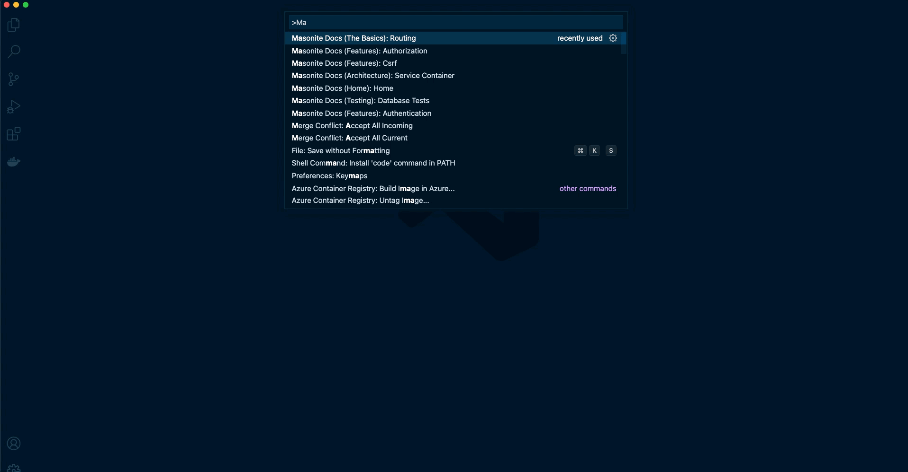

# vscode-masonite-docs

[WIP] VS Code extension to open Masonite documentation easily.

## Maintainers

- [Samuel Girardin](https://github.com/girardinsamuel)

## License

`vscode-masonite-docs` is open-sourced software licensed under the [MIT license](LICENSE).

## Inspiration / Credits

[vscode-laravel-docs](https://github.com/austenc/vscode-laravel-docs)

## Documentation for VS Code publishing

[https://code.visualstudio.com/api/working-with-extensions/publishing-extension>](<https://code.visualstudio.com/api/working-with-extensions/publishing-extension>)
